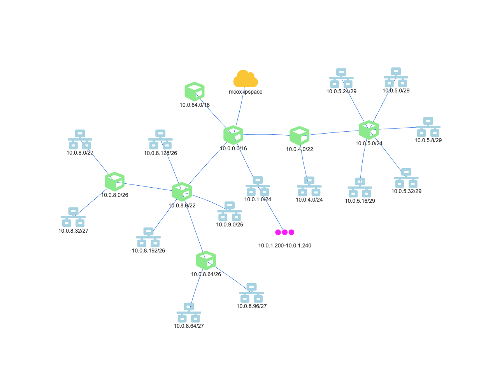

# Get-NetworkTopology

## SYNOPSIS
Used to build a text or HTML based visual topology of all related child networks

## SYNTAX

```
Get-NetworkTopology [-IncludeRanges] [-IncludeAddresses] [-IncludeSubnets] [-HTML] [-Object] <Object[]>
 [<CommonParameters>]
```

## DESCRIPTION
This function is used to build a text or HTML based visual topology of all related child networks, based on a parent IP Space, Address Block, Subnet or Range.

## EXAMPLES

### EXAMPLE 1
```powershell
Get-B1Space mcox-ipspace | Get-NetworkTopology -HTML -IncludeSubnets -IncludeRanges
```



### EXAMPLE 2
```powershell
Get-B1Space my-ipspace | Get-NetworkTopology -IncludeSubnets -IncludeAddresses -IncludeRanges

Building Network Topology. This may take a moment..
[P] / [ip_space]
    [AB] 10.0.0.0/16 [address_block]
        [AB] 10.0.64.0/18 [address_block]
        [AB] 10.0.8.0/22 [address_block]
            [SN] 10.0.8.128/26 [subnet]
                [AD] 10.0.8.128 [address]
                [AD] 10.0.8.191 [address]
            [SN] 10.0.8.192/26 [subnet]
                [AD] 10.0.8.192 [address]
                [AD] 10.0.8.255 [address]
            [SN] 10.0.9.0/26 [subnet]
                [AD] 10.0.9.0 [address]
                [AD] 10.0.9.63 [address]
            [AB] 10.0.8.0/26 [address_block]
                [SN] 10.0.8.0/27 [subnet]
                    [AD] 10.0.8.0 [address]
                    [AD] 10.0.8.31 [address]
                [SN] 10.0.8.32/27 [subnet]
                    [AD] 10.0.8.32 [address]
                    [AD] 10.0.8.63 [address]
            [AB] 10.0.8.64/26 [address_block]
                [SN] 10.0.8.64/27 [subnet]
                    [AD] 10.0.8.64 [address]
                    [AD] 10.0.8.95 [address]
                [SN] 10.0.8.96/27 [subnet]
                    [AD] 10.0.8.96 [address]
                    [AD] 10.0.8.127 [address]
        [AB] 10.0.4.0/22 [address_block]
            [SN] 10.0.4.0/24 [subnet]
                [AD] 10.0.4.0 [address]
                [AD] 10.0.4.255 [address]
            [AB] 10.0.5.0/24 [address_block]
                [SN] 10.0.5.0/29 [subnet]
                    [AD] 10.0.5.0 [address]
                    [AD] 10.0.5.7 [address]
                [SN] 10.0.5.8/29 [subnet]
                    [AD] 10.0.5.8 [address]
                    [AD] 10.0.5.15 [address]
                [SN] 10.0.5.16/29 [subnet]
                    [AD] 10.0.5.16 [address]
                    [AD] 10.0.5.23 [address]
                [SN] 10.0.5.24/29 [subnet]
                    [AD] 10.0.5.24 [address]
                    [AD] 10.0.5.31 [address]
                [SN] 10.0.5.32/29 [subnet]
                    [AD] 10.0.5.32 [address]
                    [AD] 10.0.5.39 [address]
        [SN] 10.0.1.0/24 [subnet]
            [AD] 10.0.1.22 [address]
            [RG] 10.0.1.200-10.0.1.240 [range]
            [AD] 10.0.1.20 [address]
            [AD] 10.0.1.0 [address]
            [AD] 10.0.1.255 [address]
            [AD] 10.0.1.25 [address]
```

## PARAMETERS

### -IncludeRanges
Determines whether range objects are included in the topology output.
This may make the results take longer if there are a large number of range objects.

```yaml
Type: SwitchParameter
Parameter Sets: (All)
Aliases:

Required: False
Position: Named
Default value: False
Accept pipeline input: False
Accept wildcard characters: False
```

### -IncludeAddresses
Determines whether address objects are included in the topology output.
This will make the results take longer if there are a large number of address objects.

```yaml
Type: SwitchParameter
Parameter Sets: (All)
Aliases:

Required: False
Position: Named
Default value: False
Accept pipeline input: False
Accept wildcard characters: False
```

### -IncludeSubnets
Determines whether subnet objects are included in the topology output.
This may make the results take longer if there are a large number of subnet objects.

```yaml
Type: SwitchParameter
Parameter Sets: (All)
Aliases:

Required: False
Position: Named
Default value: False
Accept pipeline input: False
Accept wildcard characters: False
```

### -HTML
Using the -HTML switch will open a HTML based Network Topology viewer

```yaml
Type: SwitchParameter
Parameter Sets: (All)
Aliases:

Required: False
Position: Named
Default value: False
Accept pipeline input: False
Accept wildcard characters: False
```

### -Object
The IP Space, Address Block, Subnet or Range to build a visual topology from.
This parameter expects pipeline input.

```yaml
Type: Object[]
Parameter Sets: (All)
Aliases:

Required: True
Position: 1
Default value: None
Accept pipeline input: True (ByValue)
Accept wildcard characters: False
```

### CommonParameters
This cmdlet supports the common parameters: -Debug, -ErrorAction, -ErrorVariable, -InformationAction, -InformationVariable, -OutVariable, -OutBuffer, -PipelineVariable, -Verbose, -WarningAction, and -WarningVariable. For more information, see [about_CommonParameters](http://go.microsoft.com/fwlink/?LinkID=113216).

## INPUTS

## OUTPUTS

## NOTES

## RELATED LINKS
